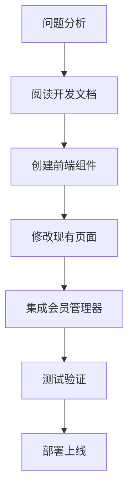

# 会员系统文档索引

## 📁 目录结构

本目录包含了完整的会员系统相关文档和代码文件，统一管理便于维护。

### 📋 文档列表

#### 核心文档
- **[会员前端交互页面开发文档.md](./会员前端交互页面开发文档.md)** - 完整的前端交互开发规范
- **[会员前端集成实施指南.md](./会员前端集成实施指南.md)** - 具体的实施步骤和修改指南
- **[会员系统.md](./会员系统.md)** - 会员系统整体设计文档
- **[会员系统最佳实践方案.md](./会员系统最佳实践方案.md)** - 最佳实践和优化建议

#### 逻辑文档
- **[../logic/会员码兑换系统逻辑文档.md](../logic/会员码兑换系统逻辑文档.md)** - 会员码兑换系统详细逻辑

### 🔧 代码文件

#### 后端API文件
- `auth_helper.php` - 认证辅助函数
- `check_download_permission.php` - 下载权限检查
- `delete_membership_codes.php` - 删除会员码
- `generate_membership_codes.php` - 生成会员码
- `get_membership_stats.php` - 会员码统计
- `get_recent_codes.php` - 获取最近生成的会员码
- `get_user_membership.php` - 获取用户会员信息
- `membership_functions.php` - 会员功能核心函数
- `record_download.php` - 记录下载操作
- `redeem_membership_code.php` - 兑换会员码

#### 前端文件
- `../static/js/membership-manager.js` - 会员管理器（新增）
- `../static/css/membership.css` - 会员样式文件（新增）

## 🚀 快速开始

### 问题描述
用户反馈：会员码兑换成功后，前端页面未相应更新显示会员状态，仍显示为"普通会员"。

### 解决方案
1. **阅读开发文档** - 查看 `会员前端交互页面开发文档.md`
2. **按照实施指南** - 遵循 `会员前端集成实施指南.md` 的步骤
3. **集成前端组件** - 使用 `membership-manager.js` 和 `membership.css`
4. **修改现有页面** - 更新 `dashboard.html` 和 `dashboard.js`

### 核心功能
- ✅ 动态会员状态显示
- ✅ 会员权益展示
- ✅ 会员升级交互
- ✅ 会员码兑换界面
- ✅ 实时状态更新
- ✅ 错误处理机制

## 📖 文档说明

### 会员前端交互页面开发文档
**用途**: 完整的前端开发规范和组件设计  
**包含**: HTML结构、JavaScript逻辑、CSS样式、API对接、测试方案  
**适用**: 前端开发人员参考

### 会员前端集成实施指南
**用途**: 具体的修改步骤和实施方案  
**包含**: 详细的代码修改指导、文件清单、测试验证  
**适用**: 直接按步骤实施

### 会员系统最佳实践方案
**用途**: 系统优化和最佳实践建议  
**包含**: 性能优化、安全考虑、用户体验提升  
**适用**: 系统优化和长期维护

## 🔄 实施流程

### 实施步骤
1. **准备阶段** (15分钟)
   - 阅读 `会员前端交互页面开发文档.md`
   - 了解整体架构和设计思路

2. **开发阶段** (90分钟)
   - 按照 `会员前端集成实施指南.md` 修改文件
   - 集成 `membership-manager.js` 和 `membership.css`
   - 更新 `dashboard.html` 和 `dashboard.js`

3. **测试阶段** (30分钟)
   - 功能测试：会员状态显示、升级交互、错误处理
   - 兼容性测试：不同浏览器、响应式布局
   - 用户体验测试：交互流程、视觉效果

4. **部署阶段** (15分钟)
   - 清理浏览器缓存
   - 验证API接口正常
   - 监控错误日志

## 🛠️ 技术栈

### 前端技术
- **HTML5** - 语义化结构
- **CSS3** - 现代样式和动画
- **JavaScript ES6+** - 模块化开发
- **Tailwind CSS** - 实用优先的CSS框架
- **Font Awesome** - 图标库

### 后端技术
- **PHP** - 服务端逻辑
- **MySQL** - 数据存储
- **PDO** - 数据库访问
- **JSON** - 数据交换格式

## 📊 功能特性

### 会员类型支持
- **免费用户** - 基础功能
- **1元会员** - 月度权益（10次下载/月）
- **永久会员** - 无限制权益

### 交互功能
- **状态显示** - 实时会员状态和权益
- **升级界面** - 直观的升级选项
- **兑换流程** - 简化的会员码兑换
- **错误处理** - 友好的错误提示
- **响应式设计** - 多设备适配

### 技术特性
- **模块化设计** - 独立的会员管理器
- **事件驱动** - 组件间通信
- **缓存机制** - 性能优化
- **错误恢复** - 自动重试和降级

## 🔍 故障排除

### 常见问题
1. **会员状态不更新**
   - 检查 `membership-manager.js` 是否正确加载
   - 验证API接口返回数据格式
   - 查看浏览器控制台错误信息

2. **模态框不显示**
   - 确认HTML结构正确添加
   - 检查CSS样式文件加载
   - 验证事件绑定是否正常

3. **样式显示异常**
   - 确认 `membership.css` 正确引用
   - 检查Tailwind CSS冲突
   - 验证响应式断点设置

### 调试工具
- **浏览器开发者工具** - Console、Network、Elements
- **API测试工具** - Postman、curl
- **日志监控** - 服务器错误日志

## 📈 性能优化

### 前端优化
- **缓存策略** - 5分钟会员状态缓存
- **懒加载** - 非关键组件延迟加载
- **事件节流** - 防止频繁API调用

### 后端优化
- **数据库索引** - 优化查询性能
- **缓存机制** - Redis/Memcached
- **API限流** - 防止滥用

## 🔒 安全考虑

### 前端安全
- **输入验证** - 会员码格式验证
- **XSS防护** - 内容转义
- **CSRF保护** - 请求令牌验证

### 后端安全
- **参数绑定** - 防止SQL注入
- **权限验证** - 用户身份确认
- **日志记录** - 操作审计

## 📞 支持与维护

### 联系方式
- **技术支持** - 查看项目文档
- **问题反馈** - 提交Issue
- **功能建议** - 参与讨论

### 维护计划
- **定期更新** - 功能优化和Bug修复
- **性能监控** - 系统性能指标
- **用户反馈** - 持续改进

---

**文档版本**: v1.0  
**创建日期**: 2024-01-27  
**最后更新**: 2024-01-27  
**维护团队**: AI Assistant

> 💡 **提示**: 建议按照实施指南的步骤顺序进行开发，确保每个步骤都经过测试验证后再进行下一步。